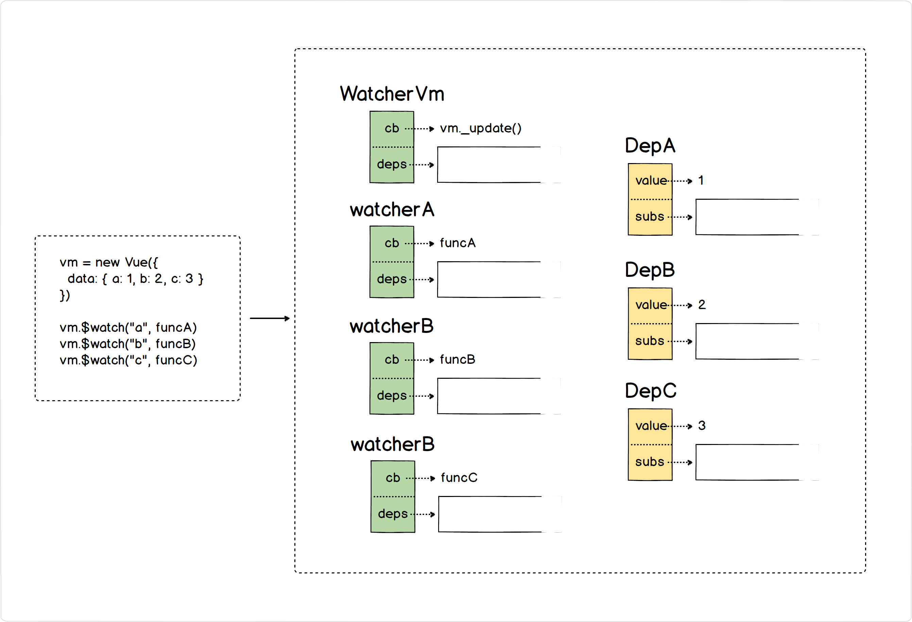
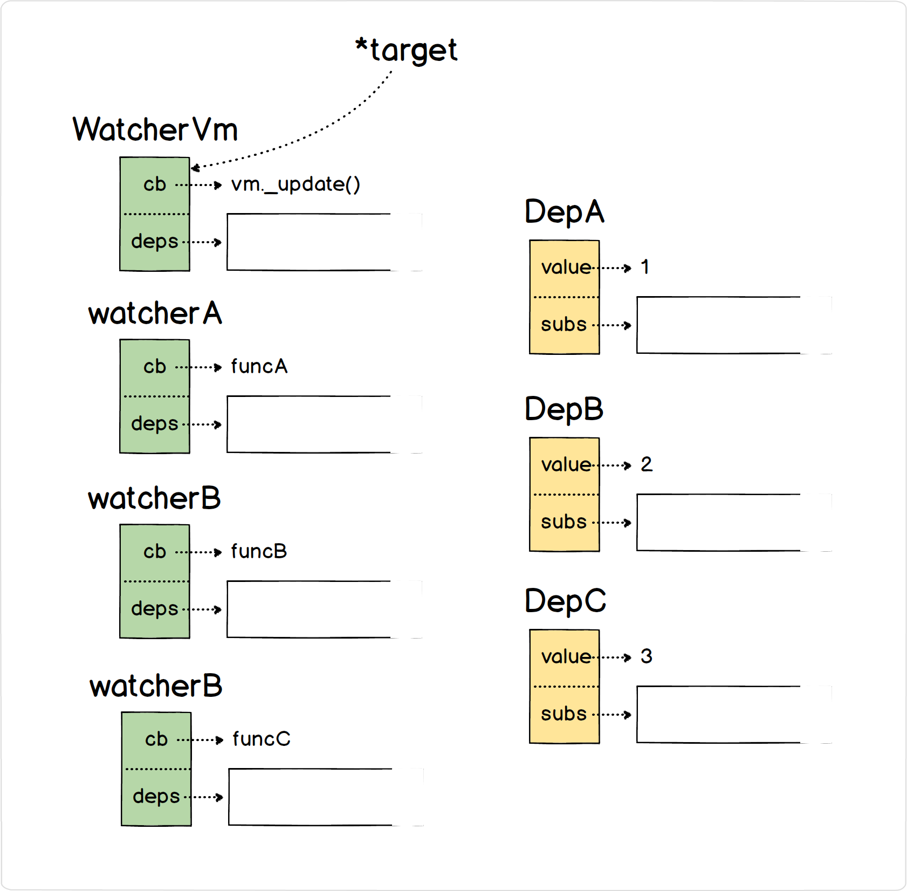
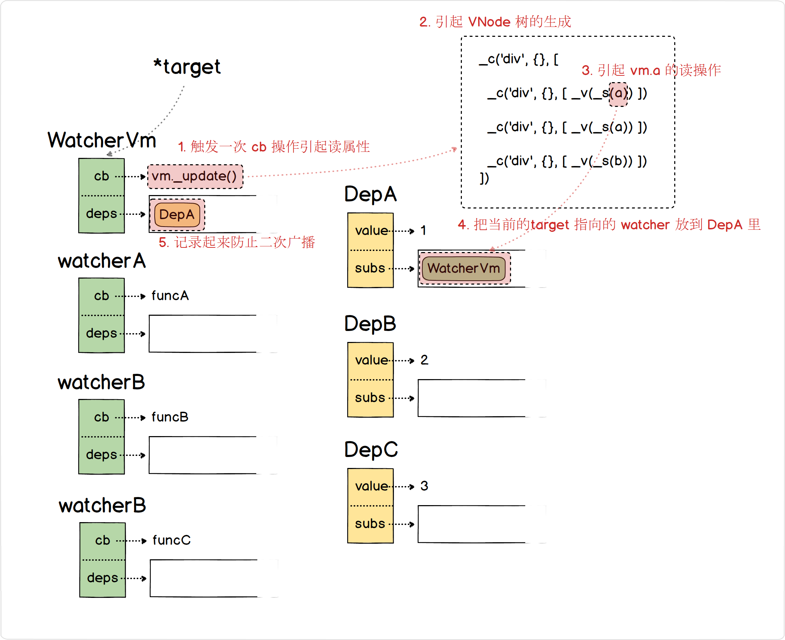
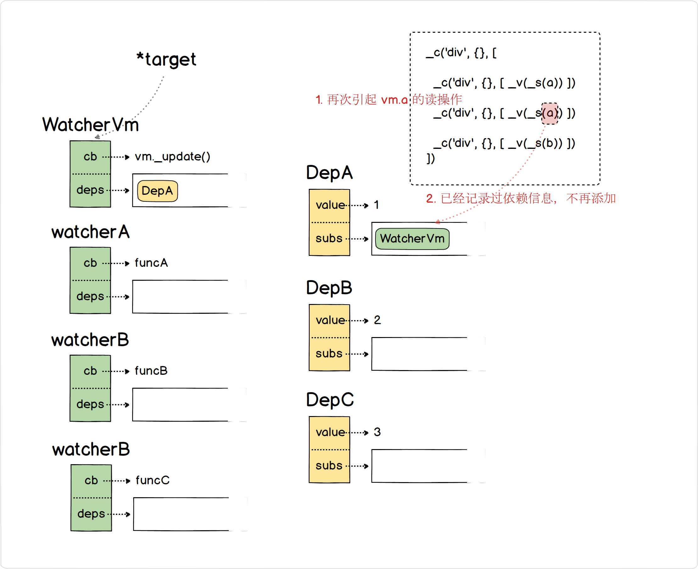
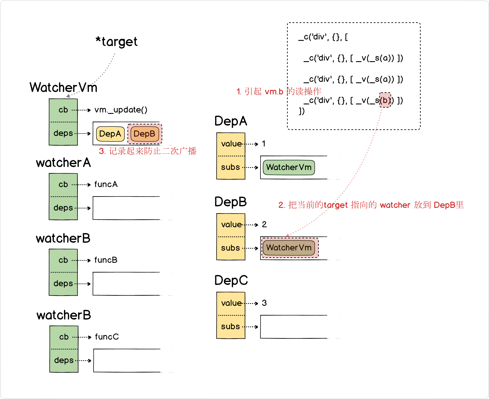
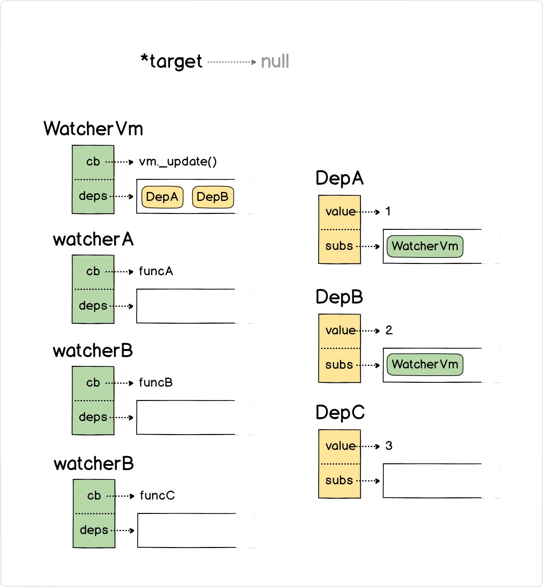
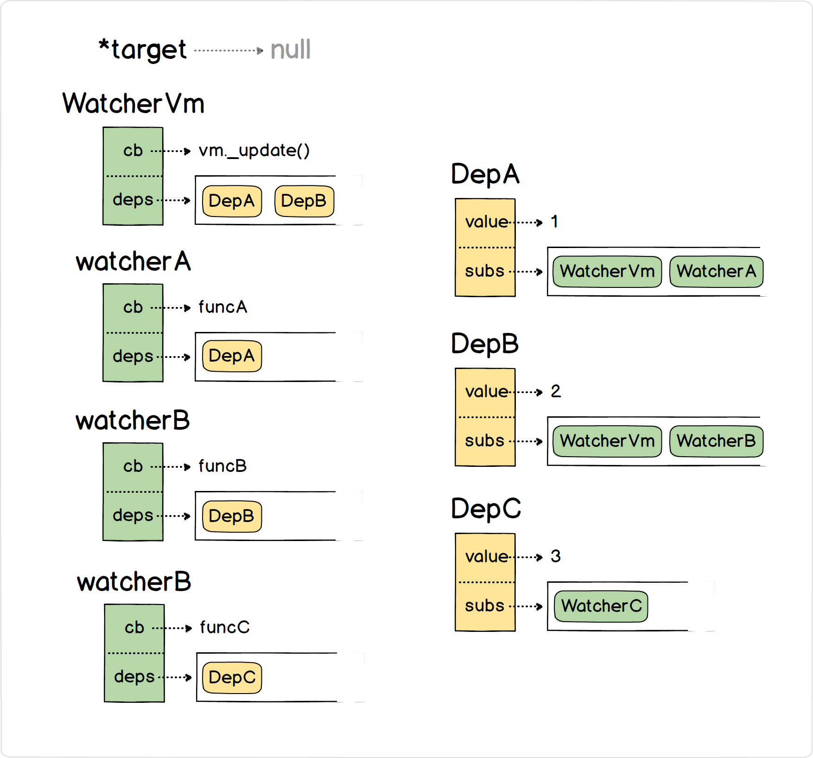
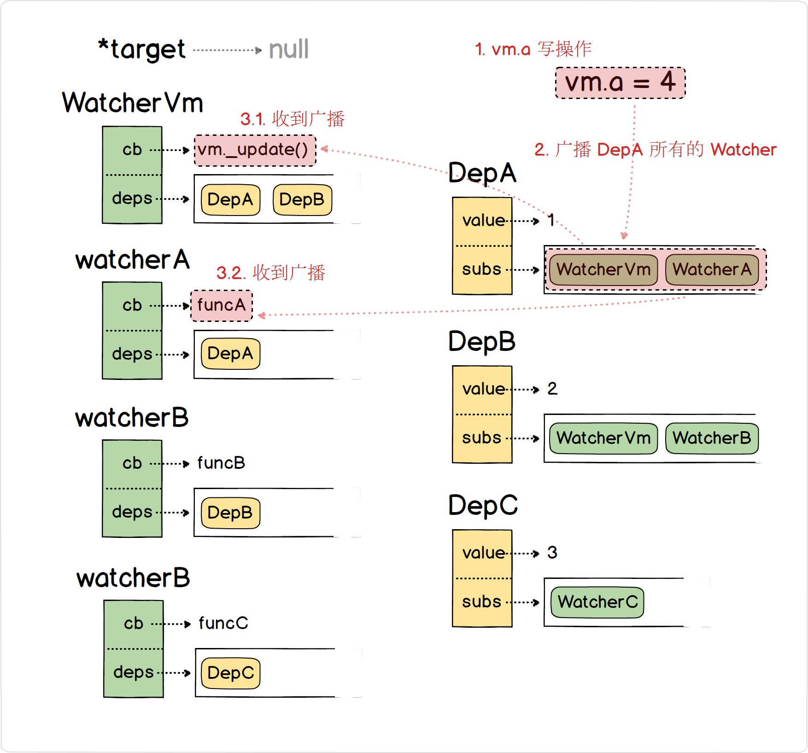

# 2.3.2 深度追踪依赖变化

## 前言

在 [2.3.1 响应式原理](https://github.com/raphealguo/how-to-learn-vue2-blob/blob/master/articles/2.3.1.md) 节中，只要任何数据变化都一定会引起 VNode 树的更新计算，显然不是最高效的。因为界面不一定绑定了所有 vm 的所有属性，例如:

```html
<div>
  <div>{{ a }}</div>
  <div>{{ b }}</div>
</div>
```

```javascript
vm = new Vue({
  data: { a: 1, b: 2, c: 3 }
})
```

当执行 vm.c = 4 的时候，在上一节中，我们并不知道当前模板没有绑定 c ，所以依旧会引起 vm._update()，导致整个 vm 的 VNode 重新生成，然后进行了 patch。

显然我们应该追踪整个 VNode 树依赖的变化。

问题就是，什么情况下我们可以认为 data 的某个属性被 vm 所依赖？

在 vm 渲染 VNode 树的过程中，data 的某个属性值执行 **读操作** 的时候，那么可以说明渲染依赖了这个属性。

反之，当这些被依赖的属性执行 **写操作** 的时候，vm 视图就要被更新了。

所以追踪依赖变化的2个步骤是:

1. 收集 vm._update() 期间执行了读操作的属性;
2. 监听第一步所收集到的属性，在它们执行写操作时，执行 vm._update() 更新视图。

## 1. 如何收集依赖

我们定义一个全局对象 targetWatcher，在开始执行 vm._update() 之前，先生成一个 targetWatcher:

```javascript
targetWatcher = null

//开始收集依赖 pushTarget(this)
targetWatcher = new Watcher()

// 更新视图
vm._update()

//结束收集依赖 popTarget()
targetWatcher = targetStack.pop()
```

在执行 vm._update() 期间，属性执行 **读操作** 时需要把信息记录在当前 targetWatcher 这个 Watcher 上:

```javascript
// core/observer/index.js
Object.defineProperty(obj, key, {
  enumerable: true,
  configurable: true,
  get: function reactiveGetter () {
    // 读操作
    // 把当前的属性绑定的依赖信息 DepA 记录在 targetWatcher 上，反向绑定信息记录在 DepA 里边
    // targetWatcher.addDep(DepA)
    // DepA.subs.push(targetWatcher)
    return val
  },
  set: function reactiveSetter (newVal) {
  }
})
```

## 2.追踪写操作更新视图

追踪写操作相对简单一点，我们只需要在 setter 触发的时候，提醒所有依赖了这个属性的 Watcher 进行更新即可。

```javascript
// core/observer/index.js
Object.defineProperty(obj, key, {
  enumerable: true,
  configurable: true,
  get: function reactiveGetter () {
    // 读操作
    return val
  },
  set: function reactiveSetter (newVal) {
    // notify all Watchers
    // DepA.notify = () => {
    // 	for (i in Deps.subs) { DepA.subs[i].update() }
    // }
    // targetWatcher.update = () => { vm._update() }
  }
})
```

## 总结

下边我们一个案例来说明如何通过 Watcher 和 Dep 两个数据结构追踪变化的过程:

```html
<div>
  <!-- 留意这里有两次 a 的 读操作 -->
  <div>{{ a }}</div>
  <div>{{ a }}</div>
  <div>{{ b }}</div>
</div>
```

```javascript
vm = new Vue({
  data: { a: 1, b: 2, c: 3 }
})

vm.$watch("a", funcA)
vm.$watch("b", funcB)
vm.$watch("c", funcC)
```

1. 在还没开始渲染视图的时候，先生成一个 Watcher 挂在 vm 对象上，同时 data 的所有属性都关联一个 Dep 对象，其他通过 vm.$watch() 也会生成对应的 Watcher:

   


2. 执行 vm._update() 前，把 target 指向当前 Watcher:
   

3. 开始收集依赖
   

   

   

4. vm._update() 执行完之后，target 指针移除指向，结束收集:
   

5. 同理，我们可以收集到所有 Watcher 的依赖信息:
   

6. 写操作 vm.a = 4，触发 vm._update() 和 funcA:
   

7. 写操作 vm.c = 5，触发 funcC: 
   

Vue 官方关于响应式原理也 [深入响应式原理](https://cn.vuejs.org/v2/guide/reactivity.html)，下图为 Vue 官方针对其响应式原理说明的流程图:


