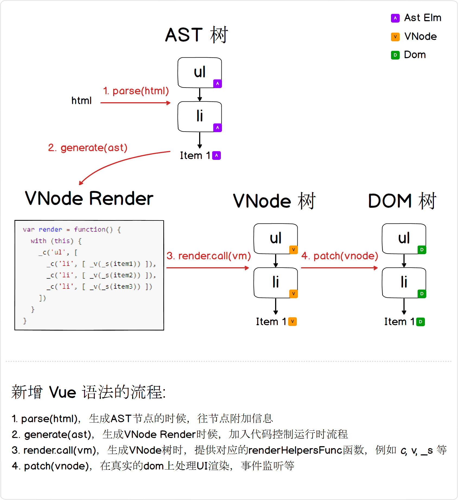

# 2.4.1 事件处理 

## 前言

前边一直在介绍如何渲染界面，当你需要和界面做交互的时候，就需要涉及到 Dom 的事件处理，所以在这一节，我们也要往之前的模型里边加上监听事件的语法。

Vue 采用 v-on:click (简写 @click) 来绑定当前的 Dom 元素的 click 事件，可以见[Vue 事件处理官方文档](https://cn.vuejs.org/v2/guide/events.html)。

回顾前边多次提到的新增语法的四个步骤:



a. 以下 HTML:

```html
<button v-on:click="clickme">click me</button>
```

b. 解析后得到的 AST 节点:

```javascript
evtAstElm = {
  type: 1,
  tag: 'button',
  events: {
    'click': { value: 'clickme' }
  },
  children: [ /* blabla.. */ ]
}
```

c. 生成的 render code:

```javascript
_c('button', { 
  on: { "click": clickme } 
}, [ _v("click me")] )
```

d. 得到一个带属性的 VNode 节点:

```javascript
VNode {
  tag: 'button',
  data: {
    on: { "click": clickme } 
  },
  children: [ /* blabla.. */ ]
}
```

c. 生成的 render code ( clickme 函数需要代理到当前的 vm 对象上，同时绑上 vm 这个运行时 context):

```javascript
_c('button', { 
  on: { "click": clickme } 
}, [ _v("click me")] )
```

e. 最后渲染在 dom 上的时候:

```javascript
buttonDom.addEventListener('click', clickme)
```

## 1. AST 节点附带事件信息

在解析 AST  树节点的属性时，识别 v-on: 开头的属性名字然后记录在当前节点的 events 上:

```javascript
// compiler/parser/index.js
function processAttrs (el) {
    // blabla..
  for (i = 0, l = list.length; i < l; i++) {
    // blabla..

    if (dirRE.test(name)) { // dirRE = /^v-|^:/
      // blabla..

      if (bindRE.test(name)) { // bindRE = /^:|^v-bind:/
        // blabla..
      } else if (onRE.test(name)) { // onRE = /^v-on:/
        name = name.replace(onRE, '') 
        // name = 'click', value = "xxxx"
        addHandler(el, name, value)
      }
    } else {
      addAttr(el, name, JSON.stringify(value))
    }
  }
}

function addHandler (el, name, value) {
  let events
  // 塞到当前 AST 节点的 events 属性里
  events = el.events || (el.events = {})
  const newHandler = { value }
  const handlers = events[name]
  /* istanbul ignore if */
  if (Array.isArray(handlers)) {
    handlers.push(newHandler)
  } else if (handlers) {
    events[name] = [handlers, newHandler]
  } else {
    events[name] = newHandler
  }
}
```

## 2. 生成 VNode render 加入事件属性

代码比较简单，直接上源码:

```javascript
// compiler/codegen/index.js
import { genHandlers } from './events'
function genData (el) {
  let data = '{'

  if (el.key) { }
  if (el.attrs) { }
  if (el.props) { }
  
  // event handlers
  if (el.events) {
    data += `${genHandlers(el.events)},`
  }

  data = data.replace(/,$/, '') + '}'

  return data
}

// compiler/codegen/events.js
export function genHandlers (events) {
  let res = 'on:{'
  for (const name in events) {
    res += `"${name}":${genHandler(name, events[name])},`
  }
  return res.slice(0, -1) + '}'
}

// name = 'click', handler = 'clickme'
function genHandler (name, handler) {
  if (!handler) {
    return 'function(){}'
  } else if (Array.isArray(handler)) {
    return `[${handler.map(handler => genHandler(name, handler)).join(',')}]`
  } else {
    return handler.value
  }
}
```

## 3. 提供运行时的 renderHelpersFunc

事件的处理无需再提供运行时的 renderHelpersFunc，但是 clickme 这个函数要代理在当前的 vm 对象上，同时在运行时的上下文要绑定在当前 vm 上:

```javascript
// core/instance/index.js

Vue.prototype._init = function (options) {
  // blabla..
  if (options.methods) initMethods(vm, options.methods)
  // blabla..
}

// 代理 methods 上所有的方法名字，同时所有的方法绑定当前 vm 对象作为上下文
function initMethods(vm, methods) {
  for (const key in methods) {
    vm[key] = methods[key] == null ? noop : bind(methods[key], vm)
  }
}
```

## 4. 在渲染 Dom 树时监听事件

我们在 patch 阶段更新处理一下 VNode 上绑定的事件属性:

```javascript
// core/vdom/patch.js
import { updateDOMListeners } from './events'
function patchVnode (oldVnode, vnode, removeOnly) {
  // blabla.. 
  if (hasData) {
    updateAttrs(oldVnode, vnode)
    updateDOMProps(oldVnode, vnode)
    updateDOMListeners(oldVnode, vnode)
  }
  // blabla.. 
}

function createElm (vnode, parentElm, refElm) {
  // blabla.. 
  if (isDef(tag)) {
    // blabla..
    updateAttrs(emptyNode, vnode)
    updateDOMProps(emptyNode, vnode)
    updateDOMListeners(emptyNode, vnode)
    // blabla.. 
  } else {
    // blabla.. 
  }
}
```

我们需要 diff 前后的 VNode 的事件监听器，做新增的事件做 add 监听和对已经移除的事件做 remove 移除:

```javascript
// core/vdom/events.js
import { warn } from 'core/util/index'

let target

function add (event, handler, capture) {
  target.addEventListener(event, handler, capture)
}

function remove (event, handler, capture, _target) {
  (_target || target).removeEventListener(event, handler, capture)
}

function updateListeners (on, oldOn) {
  let name, cur, old, event
  for (name in on) {
    cur = on[name]
    old = oldOn[name]
    event = { name, capture: false }
    if (!cur) { // v-on:click="clickme" 找不到clickme同名方法定义
      warn(
        `Invalid handler for event "${event.name}": got ` + String(cur)
      )
    } else {
      add(event.name, cur, event.capture)
    }
  }

  // 把旧的监听移除掉
  for (name in oldOn) {
    if (!on[name]) {
      event = { name, capture: false }
      remove(event.name, oldOn[name], event.capture)
    }
  }
}

export function updateDOMListeners (oldVnode, vnode) {
  if (!oldVnode.data.on && !vnode.data.on) {
    return
  }
  const on = vnode.data.on || {}
  const oldOn = oldVnode.data.on || {}
  target = vnode.elm
  updateListeners(on, oldOn)
}
```

## 后续

现在有了事件处理的语法之后， todo 案例可以加上界面交互，我们可以往文本框上加入 keydown / keyup 事件，在回车的时候把输入的值 append 到 todolist 里边去:

```html
<!-- index.html -->
<input class="new-todo" v-bind:value="newTodo" v-on:keydown="inputTodo" v-on:keyup="addTodo">
```

```javascript
// app.js
new Vue({
  methods: {
    inputTodo: function($event){
      this.newTodo = $event.target.value;
    },
    addTodo: function ($event) {
      if ($event.which !== 13) { return }
      var value = this.newTodo;
      this.todos.push({ title: value, completed: false });
      this.newTodo = '';
    }
  }
})
```

目前的 v-on 语法还比较弱，只能接受一个方法名字，要完整的实现 todo 的案例还没办法做到，例如:

```html
<li class="todo" v-for="(todo, index) in filteredTodos">
  <div class="view">
    <label v-on:dblclick="editTodo(todo)">{{todo.title}}</label>
  </div>
</li>
```

我们在双击 todolist 某一项元素的时候，需要在双击事件里边拿到这个元素背后对应的数据。v-on 仅接受方法名 ```v-on:dblclick="editTodo"``` 的话没法知道当前元素的对应的数据。

此外我们可以再新增点语法糖，让业务代码写得更加精简。下一节我们就来扩展 v-on 的能力，同时新增点语法糖( Vue 里边的事件修饰符)。